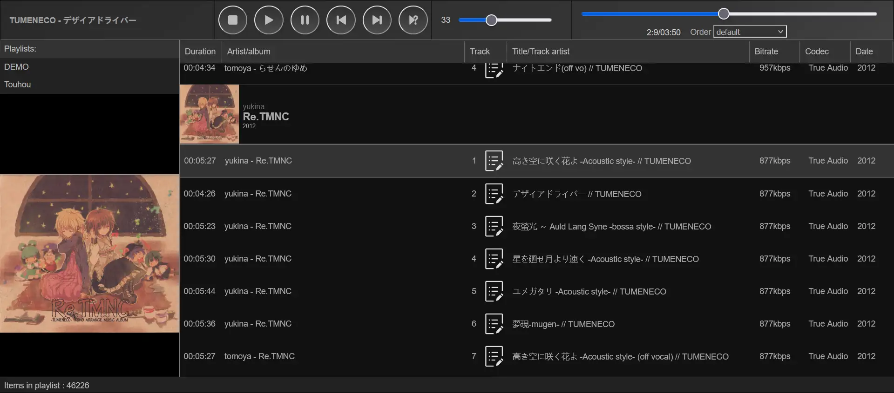
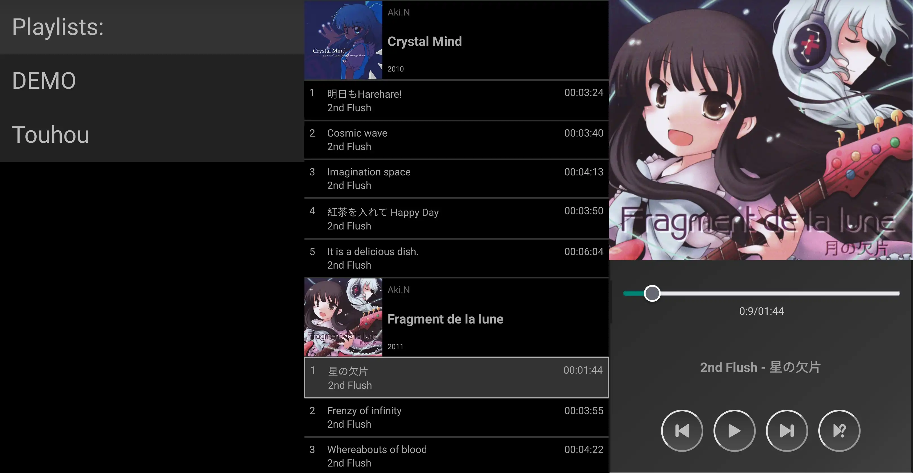

# Web Media player
Simple javascript music player
# Requirements
- php 7.4.6+ (can work on 5.2 but not tested)
- MySQL or MariaDB
# Features
- [x] Dynamic playlists
- [x] Transcoding with ffmpeg
- [x] Mobile version
## Screenshots
Desktop version

Mobile version

# Installing
1. Change paths for your website path in `web/mplayer.js`:
```
//Links for AJAX
const urlPlaylists = 'https://localhost/music/playlist/';
const urlTranscode = 'https://localhost/music/transcode.php';
const urlMain = 'https://localhost/music/';
```
2. Change in credentials  for MySQL or MariaDB connection `web/.config.php`
```
$dbservername = "127.0.0.1";
$dbusername = "username";
$dbpassword = "password";
$dbname = "database";
```
3. Import `db/mediaplayer.sql` to your database.
```
mysql -u username -p database_name < db/mediaplayer.sql
```
4. (optional) if you want to use transcoding check path for ffmpeg in `web/transcode.php` and transcoding setting if you want different settings, by default it's set to fast opus transcoding, if you want better quality you can increase bitrate or choose different codec.
```
//Config
$ffmpegBin = '/usr/bin/ffmpeg';
$codecOpt = ' -n -c:a libopus -b:a 96k -compression_level 0 ';
$fileformat = '.ogg'; 
```
## Adding playlists
1. Add corresponding record in table `playlists`. Where is name is name of playlist and path is table name for your playlist.

Example:

| id | name | path | acccesslevel |
| --- | --- | --- | --- |
| 1 | DEMO | playlist_demo | 0 |

Where is `playlist_demo` (example) is table name of your playlist.

2. Change in `db/playlist.sql` table name for your playlist 
```
DROP TABLE IF EXISTS `playlist_demo`;
CREATE TABLE IF NOT EXISTS `playlist_demo` (
```
3. Add corresponding rows for tracks in your playlist table. Most important columns you need is:

| path | album | album_artist | artist | cuesheet | directoryname | length | title | path |
| --- | --- | --- | --- | --- | --- | --- | --- | --- | 

Column `cusheet` response for transcoding if set to 1 it's gonna use transcoding, set to 0 if you don't want to use transcoding of this file
if you want to use transcoding you need to have columns `referenced_file`, `referenced_offset` (can be null) (as original filename not cue file name) make sure you have column `length` for transcoding too.

### Import playlists
You can use SQLite utilites for foobar2000 to export your playlist, correct file paths and export it to MariaDB.
You can use this as example playlist `db/playlist_example.sql`
### Working example
[Music Player example](https://neonsoftsol.com/musicplayer/)
